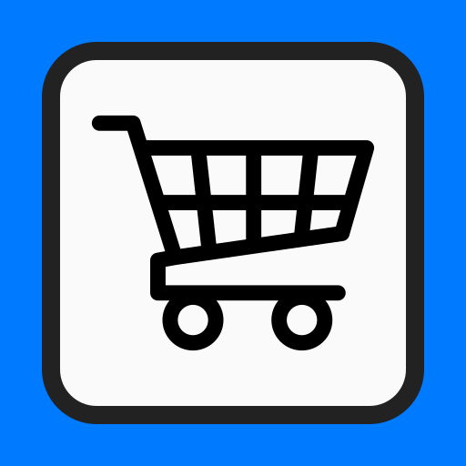
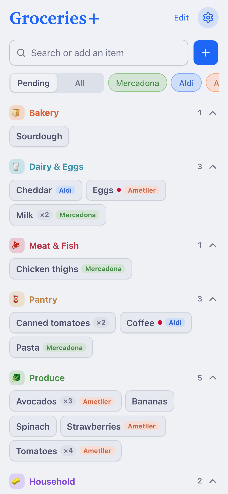
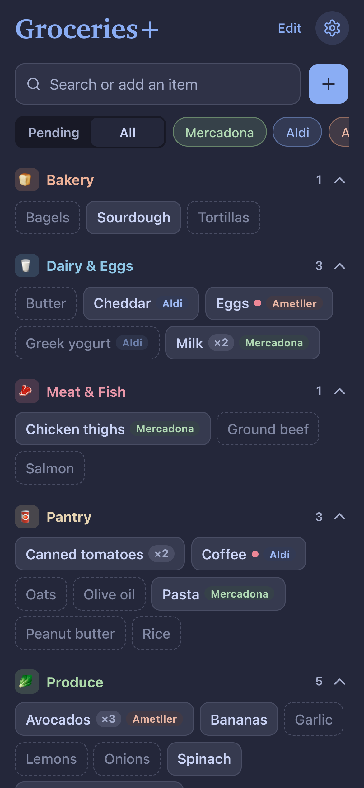
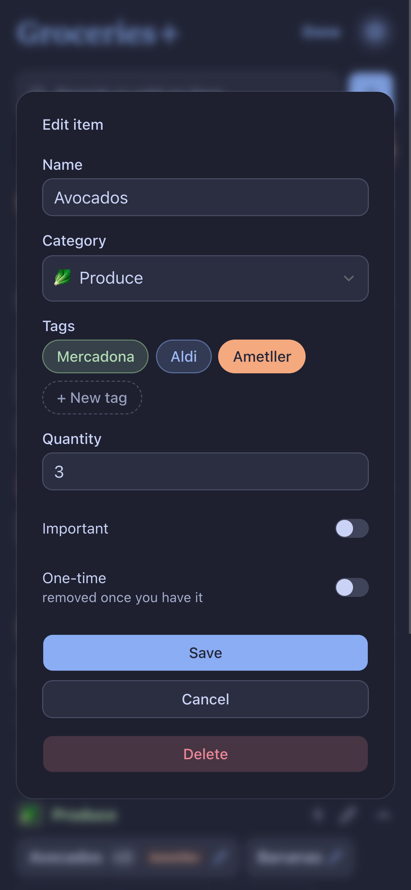

<p align="center">
  
</p>

<h1 align="center">Groceries+</h1>

<p align="center">
  A fast, private grocery list that lives on your phone.<br>
  <a href="https://tnaftali.github.io/groceries/"><strong>Open the app →</strong></a>
</p>

<p align="center">
  
  
  
</p>

---

Most list apps want an account, a subscription, or a sync server. Groceries+ wants nothing. Open the link, add it to your Home Screen, and it works like a native app: offline, instant, and with your data staying on your device.

Keep one list of everything you buy. Each item is a toggle: on when you need it, off when you have it. The Pending view shows only what you need. At the store, tap an item to switch it off until next time.

## Features

- **Search or add in one field.** Type to filter. Press Enter to add what isn't there yet.
- **Toggle tiles.** Tap an item to switch it on or off. Tiles wrap, so a whole store fits on one screen.
- **Pending and All views.** See only what you need, or your whole catalog. In All, off items show as dashed outlines.
- **Edit by long-press.** Hold a tile to edit it, or tap **Edit** and then tap any tile or category.
- **Categories.** Group items by aisle. Each category has a color. Collapse the ones you don't need.
- **Tags.** Mark items with colored tags, such as the store you buy them at. Tap a tag to show only its items.
- **Quantities, important items and one-time items.** A red dot marks important items. Sparkles mark one-time items, which disappear once you tap them off.
- **Works offline.** A service worker caches the whole app.
- **Private by design.** No account, no server, no tracking. Your list stays in your browser.
- **Export and import.** Back up your list as JSON, or move it to another device.
- **Light and dark themes.** Catppuccin Latte and Macchiato. Follows your system, or pick one in Settings.

## Install on iPhone

1. Open [tnaftali.github.io/groceries](https://tnaftali.github.io/groceries/) in Safari.
2. Tap **Share → Add to Home Screen**.

On Android, open it in Chrome and tap **Add to Home screen** (or **Install app**).

## Develop

Plain HTML, CSS and JavaScript. No build step, no dependencies to install.

```sh
python3 -m http.server 8000   # http://localhost:8000
node --test                   # logic tests
```

GitHub Pages deploys `main` as-is. After changing app files, bump `VERSION` in `sw.js` so installed copies refresh their cache.

## Credits

- UI components: [Basecoat](https://basecoatui.com)
- Colors: [Catppuccin](https://catppuccin.com)
- Icons: [Lucide](https://lucide.dev)
- Cart icon: BUSAIRI, from the Noun Project
